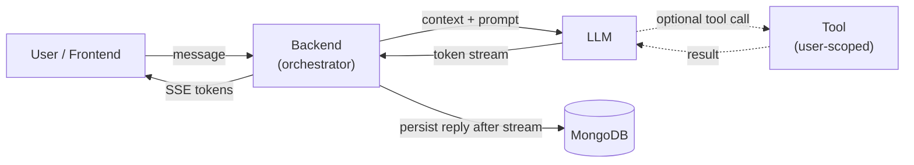

# AI Assistant Mode — Streaming + Tools

## 1. Overview

This PR adds an AI assistant mode to the chat app. A new `assistant` conversation type lets a user chat with a built-in assistant that is modeled as a real participant in the conversation. Posting a user message to an assistant conversation triggers an LLM call (OpenAI, behind a thin provider port), and the reply is streamed back token-by-token over Server-Sent Events; the frontend renders tokens live and the full message is persisted to MongoDB only after the stream completes. The assistant can call at least one tool (`list_my_conversations`) scoped to the authenticated user, with Zod-validated input/output. Prompts live in source files, and a lightweight eval set with an LLM-as-judge (Zod-validated structured output) is included.

## 2. Architecture

- **`AssistantRegistry`** — the catalog of built-in assistants. Resolves a participant id to its definition (system prompt, display name) and answers `isAssistant(participantId)`. Single source of truth for assistant identity.
- **`StreamAssistantReplyOrchestrator`** — owns the use case: loads conversation context (token-budgeted), runs the model↔tool loop, streams `token` events, and persists the assistant message on success. Emits `done` / `error` and enforces a max tool-iteration cap.
- **`LlmProvider`** — thin vendor-neutral port (`complete`, `streamTurn`). The OpenAI adapter contains all SDK specifics; swapping providers means one new adapter.
- **`ToolRegistry` / `ToolExecutor`** — registry is a name→instance whitelist; executor locates a tool, Zod-validates input, injects the authenticated `userId`, runs it, Zod-validates output, and returns a structured result (fails closed).
- **Frontend streaming hook (`useAssistantReply`)** — adds an optimistic assistant bubble, consumes SSE via a `fetch` stream reader (`sseClient`), appends token deltas to the message thread reducer, and finalizes/rolls back on `done`/`error`.

## 3. Flow

High-level path of one assistant reply: the user message is posted and persisted,
the backend orchestrator builds context and calls the LLM (optionally looping
through a tool), tokens stream back over SSE, and the full reply is saved once
streaming completes.

## 4. Key technical decisions

- **Assistant is a participant, not a separate field.** An assistant conversation stores `participantIds: [userId, assistantId]`; there is no `conversation.assistantId`. The registry decides which participant id is a built-in assistant.
- **Orchestrator owns the tool loop.** The provider only surfaces tool-call requests; the orchestrator executes them and re-invokes the model, keeping "model plans, backend executes."
- **Provider stays thin.** `LlmProvider` is vendor-neutral (`complete` / `streamTurn`); all OpenAI Responses-API specifics live in the adapter, so the provider is swappable.
- **JWT-derived `userId` is injected into tools.** The model never supplies a user id; the executor injects it from the authenticated request, so a tool can't leak another user's data.
- **Zod validates tool input and output**, and the executor fails closed on invalid I/O (structured error fed back to the model).
- **`fetch` streaming instead of `EventSource`.** The SSE endpoint is `Authorization: Bearer` (header) guarded, which `EventSource` can't set; the FE uses a `fetch` stream reader with a small SSE parser.
- **Persist-after-success only.** The assistant message is written to MongoDB only on a successful `done`; mid-stream failure or hitting the tool-iteration cap emits `error` and persists nothing.
- **Prompts as code + LLM-as-judge eval.** System/judge prompts live in source; the eval runner validates cases with Zod and uses a Zod-validated structured judgment (fail-closed) — the structured-output use case lives in eval only, not runtime.

## 5. Provider & tradeoffs

**Provider:** OpenAI (`gpt-4o-mini`) — cheap, fast, large context; kept behind `LlmProvider` so it's swappable.
**Tradeoffs:** small model keeps cost/latency low for chat; streaming improves perceived latency; tool loop is capped to bound cost; ~10k-token history trades recall for predictable cost.
