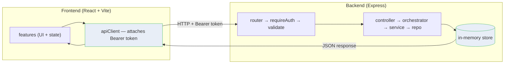

# Chat MVP

A full-stack chat app: a **React + Vite + TypeScript** frontend talking to an
**Express + TypeScript** backend over a typed HTTP contract. Conversation list on the left,
message thread + composer on the right, with optimistic sends and explicit
loading / empty / error states. The backend is mock-auth + in-memory storage — no database —
so the whole thing runs locally with two `npm run dev` commands.

## Repository layout

```
.
├─ vite-project/      # frontend — React 19 + Vite + TypeScript
├─ backend/           # backend — Express 4 + TypeScript + Zod
├─ API_CONTRACT.md    # the HTTP contract both sides implement
└─ README.md          # you are here
```

| Doc | Covers |
| --- | --- |
| [API_CONTRACT.md](API_CONTRACT.md) | Domain types, every endpoint, request/response shapes |
| [backend/README.md](backend/README.md) | Backend architecture, layering, error model |

## Stack

- **Frontend** — React 19, Vite, TypeScript (strict), Vitest + React Testing Library
- **Backend** — Express 4, TypeScript (strict), Zod validation, Vitest + Supertest, in-memory store

## Getting started

Run the two apps in separate terminals. Start the backend first so the frontend has something
to talk to.

```bash
# terminal 1 — backend on http://localhost:3000
cd backend
npm install
npm run dev

# terminal 2 — frontend on http://localhost:5173
cd vite-project
npm install
npm run dev
```

The frontend's API client points at `http://localhost:3000` and attaches the auth token as
`Authorization: Bearer <token>`. Log in by name (`Alice` or `Bob`) — mock auth, no password.

Common scripts (run inside each package):

| Script | Frontend | Backend |
| --- | --- | --- |
| `npm run dev` | Vite dev server | `tsx watch` server |
| `npm test` | Vitest | Vitest + Supertest |
| `npm run build` | type-check + Vite build | compile to `dist/` |
| `npm run lint` | ESLint | — |

---

## Architecture

The frontend gathers user input and sends an authenticated HTTP request; the backend
authenticates, validates, runs domain logic against the in-memory store, and returns JSON; the
frontend updates the screen — optimistically for sends, with rollback on failure.



### Frontend

`AuthProvider` wraps the app. `App.tsx` reads auth state — not logged in → `AuthScreen`,
otherwise `ChatPage`. `ChatPage` sets up three context providers — `ChatSelectionContext`
(which conversation is open), `ToastContext` (global errors), and `MessageThreadContext`
(the current message list) — then renders the layout. The features inside (`ConversationList`,
`MessageList`, `MessageComposer`, `Toast`) each read their own context directly; no props are
drilled between them. Every authenticated call flows through `shared/api/apiClient.ts`, which
reads the token from `localStorage` and attaches it as a Bearer header.

### Backend

`server.ts` boots the listener; the app lives in `app.ts`. Every request passes through CORS,
the request logger, and the JSON parser, then hits a feature router. Protected routes run
`requireAuth` (resolves the mock token to a `userId` on `res.locals`) and `validate` (Zod).
Inside a feature the chain is **controller → orchestrator → service → repo**, and only the repo
touches the store. A domain reaches another domain through its orchestrator, never its repo or
service directly. Anything thrown lands in one `errorHandler` that returns
`{ error: { code, message } }`. See [backend/README.md](backend/README.md) for the full layering
and error model.

---

## Frontend feature anatomy

Each feature is a self-contained folder. The public surface is `index.ts(x)`; everything
else is internal. Within a feature the code is split into three layers — a thin **container**
at the root, a **presentational** layer under `components/`, and a **pure logic** layer under
`model/` — with tests in `__tests__/`.

```
features/messageComposer/
├─ index.ts                       # public export — the only thing other features import
├─ MessageComposer.tsx            # container — calls the hook, spreads props into the view
├─ MessageComposer.use.ts         # hook — state, effects, send + rollback handlers
├─ MessageComposer.types.ts       # types and prop shapes
├─ components/                    # presentational layer — props in, UI out (no data fetching)
│  ├─ MessageComposer.view.tsx
│  ├─ MessageComposerTextarea.tsx
│  ├─ MessageComposerSendButton.tsx
│  ├─ MessageComposer.styles.ts
│  └─ MessageComposer.constants.ts
├─ model/                         # pure logic — no React, easy to unit-test
│  ├─ MessageComposer.api.ts      # adapter over the shared API client
│  └─ MessageComposer.utils.ts
└─ __tests__/
   ├─ MessageComposer.view.test.tsx
   └─ MessageComposer.api.test.ts
```

Features that own shared state keep their context and provider at the feature root next to the
container (e.g. `Auth.context.tsx` + `AuthProvider.tsx`, `ChatSelection.context.ts` +
`ChatSelectionProvider.tsx`). The provider stays thin by delegating to a composing **controller
hook** that owns the reducer and exposes only named actions — never a raw setter — so the state
has a single owner (`useAuthController`, `useMessageThreadController`). Each hook lives in its
own `*.use.ts` file.

Two features nest a smaller sub-feature with the same anatomy:
`conversationList/conversation/` (a single conversation row) and `messageList/message/`
(a single message bubble + skeleton).

### File convention (frontend)

| File              | Role                                                            |
| ----------------- | --------------------------------------------------------------- |
| `*.tsx` (root)    | Container — wires the hook to the view, exported via `index`    |
| `*.use.ts`        | React hook — state, effects, handlers                           |
| `*.types.ts`      | TypeScript types and prop shapes                                |
| `*.context.ts(x)` | `createContext` + accessor hook                                 |
| `*Provider.tsx`   | Context provider component                                      |
| `*.view.tsx`      | Presentational component — props in, UI out                     |
| `*.styles.ts`     | Inline style objects                                            |
| `*.constants.ts`  | Magic values — sizes, labels, timeouts                          |
| `*.reducer.ts`    | Pure reducer + initial state                                    |
| `*.api.ts`        | Adapter over the shared API client                              |
| `*.storage.ts`    | Read / write to `localStorage`                                  |
| `*.utils.ts`      | Pure utility functions                                          |
| `index.ts(x)`     | Wires everything together and exports the public API            |

### Folder responsibilities (frontend)

| Folder                          | Responsibility                                                  |
| ------------------------------- | --------------------------------------------------------------- |
| `src/shared/entities`           | Shared domain types — `User`, `Conversation`, `Message`         |
| `src/shared/api`                | The HTTP API client (attaches the Bearer token)                 |
| `src/shared/styles`             | Global style tokens (colors)                                    |
| `src/features/auth`             | Login flow, auth context, reducer state machine, `localStorage` |
| `src/features/chatPage`         | Layout shell + the three chat context providers                 |
| `src/features/conversationList` | List of conversations — loading, empty, error states            |
| `src/features/messageThread`    | Message store — owns the array via a controller + named actions |
| `src/features/messageList`      | Message list — fetches on selection change, auto-scroll         |
| `src/features/messageComposer`  | Composer — optimistic send + rollback on failure                |
| `src/features/toast`            | Global error toast                                              |

For the backend's module anatomy, conventions, and error codes, see
[backend/README.md](backend/README.md).
