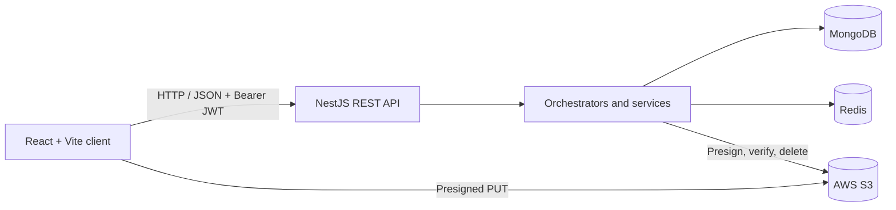

[README (2).md](https://github.com/user-attachments/files/31801538/README.2.md)
# Chat MVP


A full-stack messaging application built to demonstrate production-minded engineering practices: modular architecture, explicit domain boundaries, persistent storage, secure authentication, cursor-based pagination, transactional writes, direct-to-object-storage uploads, and automated testing.

The application provides direct and group conversations, message search, profile management, and optimistic message delivery through a React client backed by a NestJS REST API.

> **Repository note:** `backend-nest/` is the current backend implementation.  
> `backend/` contains the earlier Express-based version and is retained to show the project's architectural evolution.

## Features

### Messaging

- Create one-to-one conversations with idempotent DM creation
- Create group conversations with validated participant lists
- List conversations ordered by most recent activity
- Send messages with optimistic UI updates and rollback on failure
- Load long message histories using cursor-based pagination
- Search message content across conversations accessible to the current user
- Store a deduplicated list of recent searches

### Authentication and profiles

- Email-and-password signup and login
- Password hashing with bcrypt
- JWT-based authentication with Passport
- Protected API routes and conversation-level authorization
- Edit first name, last name, and email
- Upload, replace, and remove profile images
- Direct browser-to-S3 uploads using short-lived presigned URLs
- Server-side validation of uploaded object ownership, existence, type, and size

### Reliability and maintainability

- MongoDB transactions for multi-document operations
- Repository abstractions with MongoDB and in-memory implementations
- Redis-backed recent searches with automatic in-memory fallback
- Centralized validation, error serialization, and request logging
- Explicit DTOs and strict TypeScript across the stack
- Unit and integration tests for frontend and backend behavior
- Idempotent seed script with a 100+ message thread for pagination testing

## Architecture



### Backend request flow

```text
Controller → Orchestrator → Domain Service → Repository Port → Storage Driver
```

- **Controllers** translate HTTP requests into application inputs.
- **Orchestrators** coordinate workflows that span multiple domains.
- **Services** own domain-specific behavior.
- **Repository ports** keep business logic independent of persistence technology.
- **Storage drivers** implement those ports for MongoDB or process-local memory.
- **Unit of Work** provides a transaction boundary without coupling orchestrators to Mongoose.

For example, sending a message inserts the message and updates the conversation preview inside one MongoDB transaction. If either write fails, both are rolled back.

### Frontend organization

The client follows a feature-first structure. Each feature owns its UI, state, API adapter, types, and tests while shared infrastructure remains under `src/shared`.

A typical feature is divided into:

- a container component for wiring
- a view layer for presentation
- hooks for state and side effects
- pure model utilities
- a small adapter over the shared HTTP client
- focused unit and component tests

Cross-feature state is exposed through narrow context providers with named actions rather than raw setters.

## Technology stack

| Area | Technologies |
| --- | --- |
| Frontend | React 19, TypeScript, Vite 8, React Router |
| Client state | React Context, reducers, custom hooks, localStorage |
| HTTP | REST, JSON, Fetch API, Bearer tokens |
| Backend | NestJS 11, TypeScript, RxJS |
| Authentication | JWT, Passport, passport-jwt, bcrypt |
| Validation | class-validator, class-transformer, NestJS ValidationPipe |
| Primary database | MongoDB 7, Mongoose, @nestjs/mongoose |
| Cache / ephemeral data | Redis through ioredis, with in-memory fallback |
| Object storage | AWS S3, AWS SDK v3, presigned PUT URLs |
| Infrastructure | Docker Compose for a local MongoDB replica set |
| Frontend tests | Vitest, React Testing Library, Jest DOM, jsdom |
| Backend tests | Jest, Supertest, ts-jest, mongodb-memory-server |
| Code quality | Strict TypeScript, ESLint, Prettier |

## Repository structure

```text
.
├── vite-project/              # React frontend
│   └── src/
│       ├── features/          # Auth, chat, search, profile, toast, etc.
│       ├── routing/           # Public and protected routes
│       └── shared/            # API client, entities, UI primitives, utilities
│
├── backend-nest/              # Current NestJS backend
│   └── src/
│       ├── common/            # Errors, filters, logging, storage abstractions
│       ├── modules/           # Domain modules and use-case orchestrators
│       └── scripts/           # Database seed and S3 verification
│
├── backend/                   # Earlier Express + TypeScript implementation
├── API_CONTRACT.md            # Original API contract / project milestone
└── README.md
```

## Data model

| Collection | Purpose | Important fields |
| --- | --- | --- |
| `users` | Authentication, profile, and contacts | email, passwordHash, name, contactIds, avatarUrl |
| `conversations` | DM and group metadata | participantIds, type, dmKey, title, lastMessage, lastMessageAt |
| `messages` | Unbounded conversation history | conversationId, senderId, content, createdAt |

Messages are stored separately from conversations so threads can grow without expanding a single conversation document. Compound indexes support ordered reads and keyset pagination. A partial unique index on `dmKey` guarantees one DM per normalized participant set while excluding group conversations.

## API overview

All protected routes expect:

```http
Authorization: Bearer <token>
```

| Method | Endpoint | Description |
| --- | --- | --- |
| POST | `/auth/signup` | Create an account and return an access token |
| POST | `/auth/login` | Authenticate and return an access token |
| GET | `/me` | Return the authenticated user's profile |
| GET | `/me/contacts` | List eligible conversation contacts |
| PATCH | `/me/name` | Update first and last name |
| PATCH | `/me/email` | Update email |
| POST | `/me/avatar/presign` | Request a presigned avatar upload |
| PUT | `/me/avatar` | Commit an uploaded avatar |
| DELETE | `/me/avatar` | Remove the current avatar |
| GET | `/conversations` | List the user's conversations |
| POST | `/conversations/dm` | Get or create a direct conversation |
| POST | `/conversations/groups` | Create a group conversation |
| GET | `/conversations/:id/messages` | Read a cursor-paginated message page |
| POST | `/conversations/:id/messages` | Send a message |
| GET | `/messages/search` | Search accessible message content |
| GET | `/search/recent` | Return recent search terms |

Errors use a consistent envelope:

```json
{
  "error": {
    "code": "ERROR_CODE",
    "message": "Human-readable explanation"
  }
}
```

## Getting started

### Prerequisites

- A recent Node.js and npm installation
- Docker with Docker Compose
- Optional: Redis for persistent recent searches
- Optional: an AWS S3 bucket for real avatar storage

### 1. Clone the repository

```bash
git clone https://github.com/michael-nagen/chat-mvp.git
cd chat-mvp
```

The repository's default branch is `chat-mvp`.

### 2. Start MongoDB

The supplied Compose configuration starts MongoDB 7 as a single-node replica set, which is required for transactions.

```bash
cd backend-nest
docker compose up -d
```

### 3. Configure and start the NestJS API

```bash
npm ci
cp .env.example .env
```

For a minimal local setup, configure:

```dotenv
JWT_SECRET=replace-with-a-long-random-development-secret
STORAGE_DRIVER=mongo
MONGO_URI=mongodb://localhost:27017/chat?replicaSet=rs0&directConnection=true
PORT=3000
CORS_ORIGIN=http://localhost:5173
AVATAR_STORAGE=fake
```

Seed the development database and start the server:

```bash
npm run seed
npm run start:dev
```

The API is available at [http://localhost:3000](http://localhost:3000).

The seed creates several development users. For example:

```text
Email: alice@example.com
Password: password
```

### 4. Start the React client

In a second terminal:

```bash
cd vite-project
npm ci
npm run dev
```

Open [http://localhost:5173](http://localhost:5173).

The frontend uses `http://localhost:3000` by default. To point it elsewhere:

```dotenv
VITE_API_BASE_URL=https://api.example.com
```

## Optional services

### Redis

Set `REDIS_URL` to persist recent searches:

```dotenv
REDIS_URL=redis://localhost:6379
```

If Redis is missing or unreachable, the API logs a warning and uses an in-memory implementation.

### AWS S3 avatars

Set `AVATAR_STORAGE=s3` and configure:

```dotenv
AVATAR_STORAGE=s3
AWS_REGION=us-east-1
AWS_S3_BUCKET=your-avatars-bucket
AWS_ACCESS_KEY_ID=your-access-key-id
AWS_SECRET_ACCESS_KEY=your-secret-access-key
# AVATAR_PUBLIC_BASE_URL=https://cdn.example.com
```

The bucket must allow presigned PUT requests from the frontend origin and public or CDN-backed reads for committed avatars. The application identity requires `s3:PutObject`, `s3:GetObject`, and `s3:DeleteObject` for the avatar prefix.

Verify the S3 flow end to end with:

```bash
npm run verify:s3
```

## Scripts

### NestJS backend

| Command | Purpose |
| --- | --- |
| `npm run start:dev` | Start the API in watch mode |
| `npm run build` | Compile the production build |
| `npm run start:prod` | Run the compiled server |
| `npm run typecheck` | Run TypeScript without emitting files |
| `npm run seed` | Idempotently seed development data |
| `npm run verify:s3` | Verify the complete S3 avatar lifecycle |
| `npm test` | Run the Jest test suite |
| `npm run test:cov` | Run tests with coverage |

### React frontend

| Command | Purpose |
| --- | --- |
| `npm run dev` | Start the Vite development server |
| `npm run build` | Type-check and create a production bundle |
| `npm run preview` | Preview the production build |
| `npm test` | Run the Vitest suite |
| `npm run lint` | Run ESLint |
| `npm run format:check` | Check Prettier formatting |

## Testing strategy

The project tests behavior at multiple levels:

- pure utilities, reducers, mappers, and title derivation
- React views and user interactions
- API adapters and optimistic-send behavior
- authentication and authorization flows
- repositories against in-memory MongoDB
- orchestrators with isolated domain dependencies
- HTTP endpoints through Supertest
- error filtering and response serialization

The in-memory storage drivers and fake avatar storage keep most tests deterministic and independent of external infrastructure.

## Current scope

The application currently uses request-response REST communication. WebSockets, online presence, typing indicators, read receipts, and push notifications are not yet implemented.

Potential extensions include:

- real-time delivery through WebSockets
- refresh tokens and session revocation
- delivery and read status
- file attachments beyond avatars
- containerized application services
- CI/CD and production deployment configuration
- observability with structured logs, metrics, and tracing
