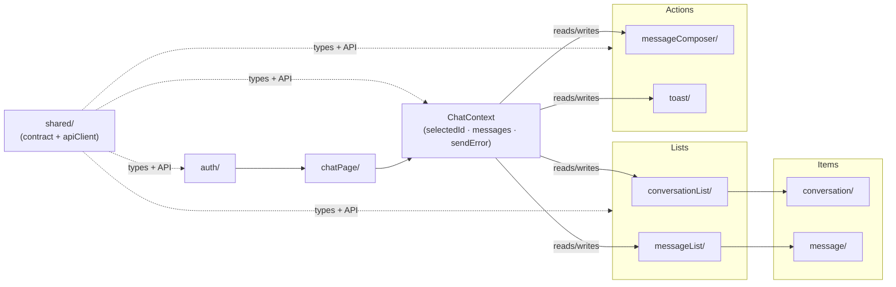

# Chat MVP

A chat UI built with **React + Vite + TypeScript** against a typed, in-memory mocked API.
Conversation list on the left, message thread + composer on the right, with optimistic
sends, cursor pagination, and explicit loading / empty / error states.

## Stack

- React 19 + Vite + TypeScript (strict mode)
- Vitest + React Testing Library
- In-memory mocked API (no backend) — see [API_CONTRACT.md](./API_CONTRACT.md)

## Getting started

```bash
cd vite-project
npm install
npm run dev      # start the dev server
npm test         # run the test suite (Vitest)
npm run build    # type-check (tsc -b) + production build
```

## Data flow



Each component reads its own data from `ChatContext` — no props are drilled through `chatPage`.

## Folder convention

Every feature folder follows the same file pattern:

| File              | Role                                                        |
| ----------------- | ----------------------------------------------------------- |
| `*.constants.ts`  | Magic values — colours, sizes, string labels                |
| `*.types.ts`      | Types and component prop shapes                             |
| `*.logic.ts`      | Pure functions — build view props, reducers (no React)      |
| `*.use.ts`        | React hook — state, effects, event handlers                 |
| `*.view.tsx`      | Presentational component — props in, UI out                 |
| `index.tsx`       | Wires the hook + view together and exports the public API   |

## Folder responsibilities

| Folder                  | Responsibility                                                         |
| ----------------------- | ---------------------------------------------------------------------- |
| `src/auth`              | Login (mocked), auth context, `useReducer` state, localStorage         |
| `src/chatPage`          | Layout shell + `ChatContext` (shared state for all chat components)    |
| `src/conversation`      | Single conversation row — selection highlight, title, preview          |
| `src/conversationList`  | List of conversations with loading skeleton and empty/error states     |
| `src/message`           | Single message bubble + skeleton placeholder                           |
| `src/messageList`       | Message thread with auto-scroll and loading/error states               |
| `src/messageComposer`   | Textarea composer — optimistic send, rollback on failure               |
| `src/toast`             | Auto-dismissing error toast                                            |
| `src/shared/chatApi`    | `apiClient.ts` (mocked API) + types + in-memory data                  |
| `src/shared/contract`   | Domain types shared with the backend (`User`, `Conversation`, `Message`) |
