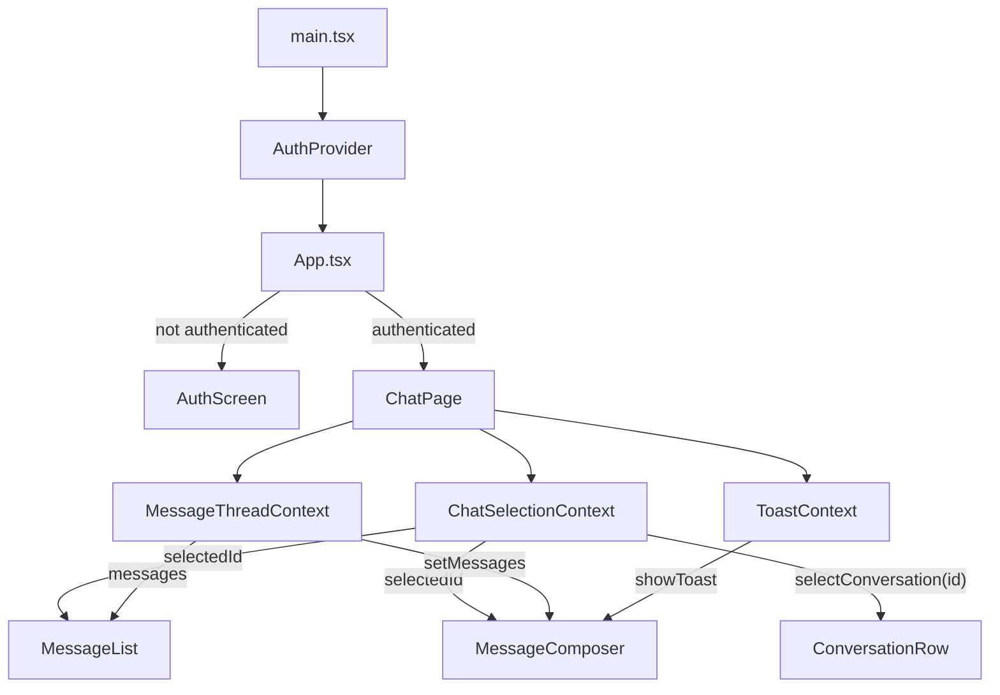

# Chat MVP

A chat UI built with **React + Vite + TypeScript** against a typed, in-memory mocked API.
Conversation list on the left, message thread + composer on the right, with optimistic sends and explicit loading / empty / error states.

## Stack

- React 19 + Vite + TypeScript (strict mode)
- Vitest + React Testing Library
- In-memory mocked API (no backend)

## Getting started

```bash
cd vite-project
npm install
npm run dev      # start the dev server
npm test         # run the test suite
npm run build    # type-check + production build
```

---

## Application flow

The app boots with `AuthProvider` wrapping everything. `App.tsx` reads auth state — if the user is not logged in it shows `AuthScreen`, otherwise it renders `ChatPage`.

`ChatPage` sets up three context providers — `ChatSelectionContext` (which conversation is open), `ToastContext` (global error messages), and `MessageThreadContext` (the current message list) — then renders the layout. The four features inside the layout (`ConversationList`, `MessageList`, `MessageComposer`, `Toast`) each read their own context directly; no props are drilled between them.

Clicking a conversation row writes the selected id into `ChatSelectionContext`. `MessageList` listens for that change and fetches the new messages. `MessageComposer` reads the same id to know where to send, appends an optimistic message immediately, and rolls back on failure with a toast.



---

## Folder convention

| File             | Role                                                             |
| ---------------- | ---------------------------------------------------------------- |
| `*.types.ts`     | TypeScript types and prop shapes                                 |
| `*.constants.ts` | Magic values — sizes, labels, timeouts                           |
| `*.context.ts`   | `createContext` + accessor hook                                  |
| `*.reducer.ts`   | Pure reducer + initial state                                     |
| `*.storage.ts`   | Read / write to localStorage                                     |
| `*.utils.ts`     | Pure utility functions                                           |
| `*.use.ts`       | React hook — state, effects, handlers                            |
| `*.view.tsx`     | Presentational component — props in, UI out                      |
| `*.styles.ts`    | Inline style objects                                             |
| `index.tsx/ts`   | Wires everything together and exports the public API             |

---

## Folder responsibilities

| Folder                  | Responsibility                                                     |
| ----------------------- | ------------------------------------------------------------------ |
| `src/entities`          | Shared domain types — `User`, `Conversation`, `Message`            |
| `src/shared/chatApi`    | Mocked API client + response types                                 |
| `src/shared/styles`     | Global style tokens (colors)                                       |
| `src/auth`              | Login flow, auth context, reducer state machine, localStorage      |
| `src/chatPage`          | Layout shell + `ChatSelectionContext`                              |
| `src/conversationList`  | List of conversations — loading, empty, error states               |
| `src/conversation`      | Single conversation row — Container + Context pattern              |
| `src/messageList`       | Message thread — fetches on selection change, auto-scroll          |
| `src/message`           | Single message bubble + skeleton                                   |
| `src/messageComposer`   | Composer — optimistic send + rollback on failure                   |
| `src/toast`             | Global error toast                                                 |
