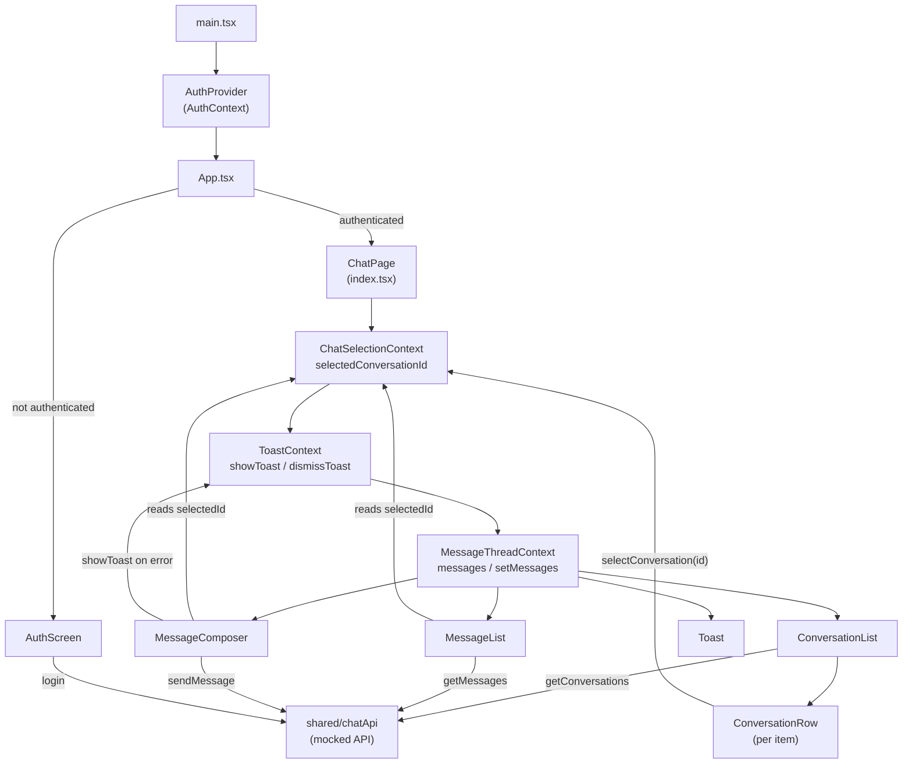

# Chat MVP

A chat UI built with **React + Vite + TypeScript** against a typed, in-memory mocked API.
Conversation list on the left, message thread + composer on the right, with optimistic
sends and explicit loading / empty / error states.

## Stack

- React 19 + Vite + TypeScript (strict mode)
- Vitest + React Testing Library
- In-memory mocked API (no backend) — see [API_CONTRACT.md](./API_CONTRACT.md)

## Getting started

```bash
cd vite-project
npm install
npm run dev      # start the dev server
npm test         # run the test suite (Vitest)
npm run build    # type-check (tsc -b) + production build
```

---

## Application flow

### 1. Entry point — `main.tsx`

The app mounts with `AuthProvider` wrapping everything.
`AuthProvider` is the first provider to run — it owns whether the user is logged in or not.

### 2. `App.tsx` — the gate

Reads `useAuth()` from `AuthContext`.

- Not authenticated → renders `<AuthScreen />`
- Authenticated → renders `<ChatPage />`

### 3. `auth/` — login flow

```
AuthProvider
  └── useAuthController (Auth.use.ts)
        ├── useReducer (Auth.reducer.ts)  — state machine: idle → loading → authenticated | error
        ├── Auth.storage.ts               — persists / restores session from localStorage
        └── loginApi (apiClient.ts)       — POST to the mocked API

AuthScreen
  └── useAuthScreen   — owns the name field + calls login()
      └── useAuthScreenView — derives submittable + handleSubmit
```

User fills the form → `login()` fires → reducer transitions to `authenticated` → `App` re-renders → `ChatPage` loads.

### 4. `chatPage/` — chat shell (providers + layout)

```
ChatPage (index.tsx)
  └── ChatSelectionProvider   — which conversation is selected (string | null)
      └── ToastProvider       — global error/info messages
          └── MessageThreadProvider  — the messages array for the current thread
              └── ChatPageView       — layout only, zero prop drilling
```

`ChatPageView` renders four self-contained features with no props passed between them:
`ConversationList`, `MessageList`, `MessageComposer`, `Toast`.

### 5. `conversationList/` — list of conversations

```
ConversationList (index.tsx)
  └── useConversationList (use.ts)
        ├── useAuth()              — get userId
        ├── getConversations(id)   — fetch from API
        └── useReducer             — loading / success / error
  └── ConversationListView
        └── ConversationRow (per item) — Container + Context pattern
              └── ConversationRowProvider
                    └── useConversationRow → useChatSelection().selectConversation(id)
```

Clicking a row calls `selectConversation(id)` on `ChatSelectionContext`.

### 6. `messageList/` — message thread

```
MessageList (MessageList.tsx)
  └── useMessageList (use.ts)
        ├── useChatSelection()     — listens for selectedConversationId changes
        ├── getMessages(id)        — fetches when id changes
        └── useMessageThread()     — writes messages into shared context
  └── MessageListView              — renders the list + auto-scroll
```

**The key link:** when the user picks a conversation → `ConversationRow` calls `selectConversation(id)` → `useMessageList` sees the id change → fetches and writes new messages into `MessageThreadContext`.

### 7. `messageComposer/` — sending messages

```
useMessageComposer
  ├── useChatSelection()   — which conversation to send to
  ├── useMessageThread()   — appends optimistic message immediately
  ├── useToast()           — shows error toast on failure
  └── sendMessage(id, text) → API
        ├── success  — replaces temp id with real message from server
        └── failure  — removes optimistic message, restores draft, shows toast
```

### Context tree at runtime

```
AuthContext                 (entire app)
  └── ChatSelectionContext  (selectedConversationId + selectConversation)
      └── ToastContext      (showToast + dismissToast)
          └── MessageThreadContext  (messages + setMessages)
```

Every feature reads its own context directly — no props are drilled through parent components.

---

## Data flow diagram



---

## Folder convention

Every feature folder follows the same file pattern:

| File             | Role                                                              |
| ---------------- | ----------------------------------------------------------------- |
| `*.types.ts`     | TypeScript types and component prop shapes                        |
| `*.constants.ts` | Magic values — sizes, string labels, timeouts                     |
| `*.context.ts`   | `createContext` + the accessor hook that throws outside provider  |
| `*.reducer.ts`   | Pure reducer function + initial state (no React)                  |
| `*.storage.ts`   | Read/write to localStorage                                        |
| `*.utils.ts`     | Pure utility functions (predicates, formatters)                   |
| `*.use.ts`       | React hook — state, effects, event handlers                       |
| `*.view.tsx`     | Presentational component — props in, UI out (one component/file)  |
| `*.styles.ts`    | Inline style objects for the feature                              |
| `index.tsx/ts`   | Wires provider + hook + view; exports the public API              |

Sub-components that belong to a single feature live in `children/`.

---

## Folder responsibilities

| Folder                    | Responsibility                                                                  |
| ------------------------- | ------------------------------------------------------------------------------- |
| `src/entities`            | Shared domain types — `User`, `Conversation`, `Message`                         |
| `src/shared/chatApi`      | Mocked API client + response types + in-memory data                             |
| `src/shared/styles`       | Global style tokens — `colors.ts` is the single source of truth for the palette |
| `src/auth`                | Login flow, auth context, reducer state machine, localStorage persistence        |
| `src/chatPage`            | Layout shell + `ChatSelectionContext` (which conversation is open)              |
| `src/conversationList`    | List of conversations — loading skeleton, empty + error states                  |
| `src/conversation`        | Single conversation row — Container + Context pattern, selection highlight       |
| `src/messageList`         | Message thread — fetches on selection change, auto-scroll, loading/error states |
| `src/message`             | Single message bubble + skeleton placeholder                                    |
| `src/messageComposer`     | Textarea composer — optimistic send + rollback on failure                       |
| `src/toast`               | Global error toast — any component can call `useToast().showToast()`            |
