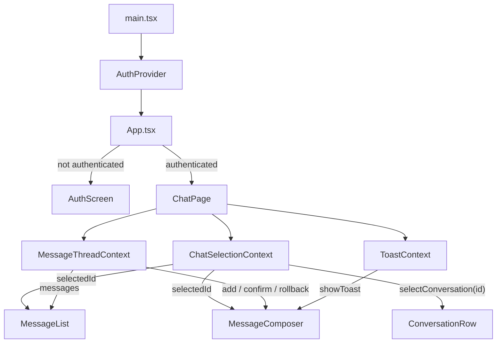

# Chat MVP

A chat UI built with **React + Vite + TypeScript** against a typed, in-memory mocked API.
Conversation list on the left, message thread + composer on the right, with optimistic sends and explicit loading / empty / error states.

## Stack

- React 19 + Vite + TypeScript (strict mode)
- Vitest + React Testing Library
- In-memory mocked API (no backend)

## Getting started

```bash
cd vite-project
npm install
npm run dev      # start the dev server
npm test         # run the test suite
npm run build    # type-check + production build
```

---

## Application flow

The app boots with `AuthProvider` wrapping everything. `App.tsx` reads auth state — if the user is not logged in it shows `AuthScreen`, otherwise it renders `ChatPage`.

`ChatPage` sets up three context providers — `ChatSelectionContext` (which conversation is open), `ToastContext` (global error messages), and `MessageThreadContext` (the current message list) — then renders the layout. The four features inside the layout (`ConversationList`, `MessageList`, `MessageComposer`, `Toast`) each read their own context directly; no props are drilled between them.

Clicking a conversation row writes the selected id into `ChatSelectionContext`. `MessageList` listens for that change and fetches the new messages. `MessageComposer` reads the same id to know where to send, appends an optimistic message immediately, and rolls back on failure with a toast.



---

## Feature anatomy

Each feature is a self-contained folder. The public surface is `index.ts(x)`; everything
else is internal. Within a feature the code is split into three layers — a thin **container**
at the root, a **presentational** layer under `components/`, and a **pure logic** layer under
`model/` — with tests in `__tests__/`.

```
features/messageComposer/
├─ index.ts                       # public export — the only thing other features import
├─ MessageComposer.tsx            # container — calls the hook, spreads props into the view
├─ MessageComposer.use.ts         # hook — state, effects, send + rollback handlers
├─ MessageComposer.types.ts       # types and prop shapes
├─ components/                    # presentational layer — props in, UI out (no data fetching)
│  ├─ MessageComposer.view.tsx
│  ├─ MessageComposerTextarea.tsx
│  ├─ MessageComposerSendButton.tsx
│  ├─ MessageComposer.styles.ts
│  └─ MessageComposer.constants.ts
├─ model/                         # pure logic — no React, easy to unit-test
│  ├─ MessageComposer.api.ts      # adapter over the shared API client
│  └─ MessageComposer.utils.ts
└─ __tests__/
   ├─ MessageComposer.view.test.tsx
   └─ MessageComposer.api.test.ts
```

Features that own shared state keep their context and provider at the feature root next to the
container (e.g. `Auth.context.tsx` + `AuthProvider.tsx`, `ChatSelection.context.ts` +
`ChatSelectionProvider.tsx`, `MessageThread.context.ts` + `MessageThreadProvider.tsx`). The
provider stays thin by delegating to a composing **controller hook** that owns the reducer and
exposes only named actions — never a raw setter — so the state has a single owner and every
consumer is limited to the writes the controller defines (`useAuthController`,
`useMessageThreadController`).

Two features nest a smaller sub-feature that follows the exact same anatomy:
`conversationList/conversation/` (a single conversation row) and `messageList/message/`
(a single message bubble + skeleton).

---

## File convention

| File              | Role                                                            |
| ----------------- | --------------------------------------------------------------- |
| `*.tsx` (root)    | Container — wires the hook to the view, exported via `index`    |
| `*.use.ts`        | React hook — state, effects, handlers                           |
| `*.types.ts`      | TypeScript types and prop shapes                                |
| `*.context.ts(x)` | `createContext` + accessor hook                                 |
| `*Provider.tsx`   | Context provider component                                      |
| `*.view.tsx`      | Presentational component — props in, UI out                     |
| `*.styles.ts`     | Inline style objects                                            |
| `*.constants.ts`  | Magic values — sizes, labels, timeouts                          |
| `*.reducer.ts`    | Pure reducer + initial state                                    |
| `*.api.ts`        | Adapter over the shared API client                              |
| `*.storage.ts`    | Read / write to `localStorage`                                  |
| `*.utils.ts`      | Pure utility functions                                          |
| `index.ts(x)`     | Wires everything together and exports the public API            |

---

## Folder responsibilities

| Folder                          | Responsibility                                                  |
| ------------------------------- | --------------------------------------------------------------- |
| `src/shared/entities`           | Shared domain types — `User`, `Conversation`, `Message`         |
| `src/shared/api`                | Mocked API client, mock server, and seed data                   |
| `src/shared/styles`             | Global style tokens (colors)                                    |
| `src/features/auth`             | Login flow, auth context, reducer state machine, `localStorage` |
| `src/features/chatPage`         | Layout shell + the three chat context providers                 |
| `src/features/conversationList` | List of conversations — loading, empty, error states            |
| `src/features/messageThread`    | Message store — owns the array via a controller + named actions |
| `src/features/messageList`      | Message list — fetches on selection change, auto-scroll         |
| `src/features/messageComposer`  | Composer — optimistic send + rollback on failure                |
| `src/features/toast`            | Global error toast                                              |
