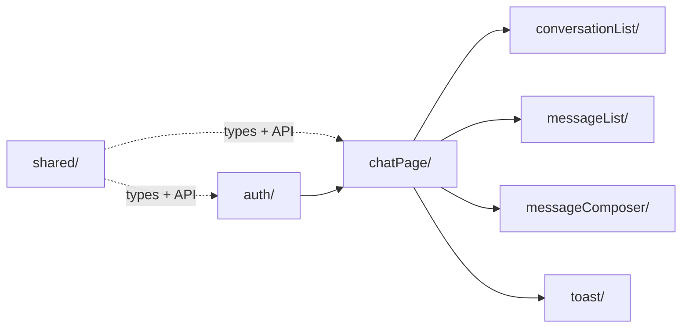

# Chat MVP

A chat UI built with **React + Vite + TypeScript** against a typed, in-memory mocked API.
Conversation list on the left, message thread + composer on the right, with optimistic
sends, cursor pagination, and explicit loading / empty / error states.

## Stack

- React 19 + Vite + TypeScript (strict mode)
- Vitest + React Testing Library
- In-memory mocked API (no backend) — see [API_CONTRACT.md](./API_CONTRACT.md)

## Getting started

```bash
cd vite-project
npm install
npm run dev      # start the dev server
npm test         # run the test suite (Vitest)
npm run build    # type-check (tsc -b) + production build
```

## Data flow



Data flows one way: `apiClient` → `*.use` hook (state) → `*.logic` (build props) →
`*.view` (render). User actions call back up through props.

## Folder convention

Every feature folder follows the same file pattern:

| File          | Role                                                       |
| ------------- | ---------------------------------------------------------- |
| `*.types.ts`  | Types and component prop shapes                            |
| `*.logic.ts`  | Pure functions — build view props, reducers (no React)     |
| `*.use.ts`    | React hook — state, effects, event handlers                |
| `*.view.tsx`  | Presentational component — props in, UI out                |
| `index.tsx`   | Wires the hook + view together and exports the public API  |

## Folder responsibilities

| Folder                     | Responsibility                                              |
| -------------------------- | ----------------------------------------------------------- |
| `src/auth`                 | Login (mocked), auth context, `useReducer` state, persistence |
| `src/chatPage`             | Top-level chat screen; orchestrates the panes               |
| `src/conversationList`     | Renders the conversation list + its states                  |
| `src/messageList`          | Renders the message thread + auto-scroll                    |
| `src/messageComposer`      | Controlled textarea + send                                  |
| `src/toast`                | Reusable auto-dismissing toast                              |
| `src/shared/chatApi`       | `apiClient.ts` (mocked API) + types + in-memory data        |
| `src/shared/contract`      | Domain types shared with the backend (`User`, `Conversation`, `Message`) |
