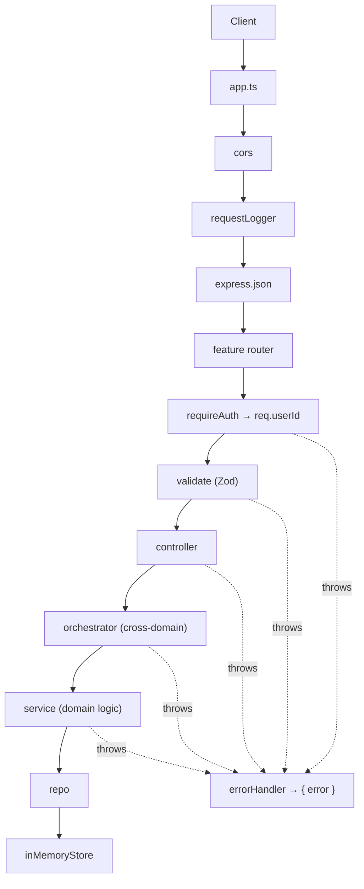

# Chat MVP — Backend

An **Express + TypeScript** server implementing the [Chat MVP API contract](../API_CONTRACT.md).
Mock auth by name, conversations, and cursor-paginated messages, backed by an in-memory
store. Every request runs through one validation → handler → error path, and each domain is
split into thin, single-responsibility layers.

## Stack

- Express 4 + TypeScript (strict mode)
- Zod for request validation
- Vitest + Supertest
- In-memory store (no database — state resets on restart)

## Getting started

```bash
cd backend
npm install
npm run dev        # start the dev server (tsx watch) on PORT (default 3000)
npm test           # run the test suite
npm run typecheck  # type-check without emitting
npm run build      # compile to dist/
npm start          # run the compiled server
```

Configure via environment variables:

| Variable      | Default                 | Description                                  |
| ------------- | ----------------------- | -------------------------------------------- |
| `PORT`        | `3000`                  | Port the server listens on.                  |
| `CORS_ORIGIN` | `http://localhost:5173` | Allowed origin(s), comma-separated.          |

---

## Request flow

`server.ts` boots the HTTP listener and handles graceful shutdown; the Express app itself
lives in `app.ts`. Every request passes through CORS, the request logger, and the JSON body
parser, then hits a feature router.

`requireAuth` reads the `Authorization: Bearer <token>` header, resolves the mock token to a
`userId`, and sets `req.userId`. `validate({ body | query | params })` parses each request part
against a Zod schema, replacing the raw input with the coerced, typed result so handlers read
clean data. Anything thrown — by middleware, a controller, or a service — lands in the single
`errorHandler`, which renders `AppError` subclasses as `{ error: { code, message } }` and
everything else as a generic 500.

Inside a feature the call chain is **controller → orchestrator → service → repo**. The
controller adapts HTTP to a plain call; the orchestrator owns cross-domain coordination; the
service holds domain logic; the repo is the only layer that touches the store.



The messages flow shows why the orchestrator layer exists: a message may only be read or
written by a participant of its conversation, and a new message updates that conversation's
preview. Both facts cross into the conversations domain, so `messages.orchestrator` reaches it
through `conversations.orchestrator` — never another domain's service directly — keeping each
service pure to its own domain.

---

## Module anatomy

Each domain is a self-contained folder under `modules/`. Within it the code is split into the
same layers, with tests in `test/`.

```
modules/messages/
├─ messages.routes.ts          # route table — wires paths to validate() + controller
├─ messages.controller.ts      # HTTP adapter — reads req, calls orchestrator, sends res
├─ messages.orchestrator.ts    # cross-domain coordination (access checks, preview update)
├─ messages.service.ts         # domain logic — pagination, message creation
├─ messages.repo.ts            # the only layer that reads/writes the store
├─ messages.schemas.ts         # Zod schemas + inferred request types
├─ messages.types.ts           # domain types (Message, MessagePage, …)
└─ test/
   ├─ messageRepository.test.ts
   ├─ messages.orchestrator.test.ts
   ├─ messages.schemas.test.ts
   └─ messages.service.test.ts
```

`auth` and `conversations` follow the same shape. A module without cross-domain needs can skip
the orchestrator, but here all three keep one so the controller always calls a single entry
point per domain.

---

## File convention

| File                | Role                                                            |
| ------------------- | --------------------------------------------------------------- |
| `*.routes.ts`       | Route table — maps paths to `validate()` + controller           |
| `*.controller.ts`   | HTTP adapter — reads the request, calls the orchestrator, responds |
| `*.orchestrator.ts` | Cross-domain coordination between services                      |
| `*.service.ts`      | Pure domain logic for one module                                |
| `*.repo.ts`         | The only layer that reads/writes the in-memory store            |
| `*.schemas.ts`      | Zod request schemas + inferred types                            |
| `*.types.ts`        | Domain TypeScript types                                         |
| `test/*.test.ts`    | Vitest unit tests for the layer they sit beside                 |

---

## Folder responsibilities

| Folder                          | Responsibility                                                       |
| ------------------------------- | -------------------------------------------------------------------- |
| `src/app.ts`                    | Express app — middleware chain, route mounting, 404 + error handler  |
| `src/server.ts`                 | HTTP listener + graceful shutdown on SIGTERM/SIGINT                  |
| `src/modules/auth`              | Mock login by name → `{ token, user }`                              |
| `src/modules/conversations`     | List a user's conversations; create a conversation                  |
| `src/modules/messages`          | Cursor-paginated message list; create a message                     |
| `src/shared/middleware`         | `requireAuth`, `validate`, `requestLogger`                          |
| `src/shared/errors`             | `AppError` hierarchy, error codes, central `errorHandler`           |
| `src/shared/http`               | `HTTP_STATUS` constants, `asyncHandler` wrapper                     |
| `src/shared/store`              | In-memory seed data (users, conversations, messages)               |
| `src/shared/types`              | Ambient types — e.g. `req.userId` on Express's `Request`            |
| `src/test`                      | End-to-end app integration tests (Supertest)                       |

---

## Error model

All errors are returned as a consistent JSON shape:

```json
{ "error": { "code": "VALIDATION_ERROR", "message": "content is required." } }
```

| Code                     | Status | Raised when                                          |
| ------------------------ | ------ | ---------------------------------------------------- |
| `VALIDATION_ERROR`       | 400    | A request part fails its Zod schema.                 |
| `UNAUTHORIZED`           | 401    | Missing/malformed header or unknown token.           |
| `CONVERSATION_NOT_FOUND` | 404    | Conversation is missing or the user isn't a member.  |
| `INTERNAL_ERROR`         | 500    | Any unexpected (non-`AppError`) throw.               |

A non-member is given the same 404 as a missing conversation so ids can't be probed.
